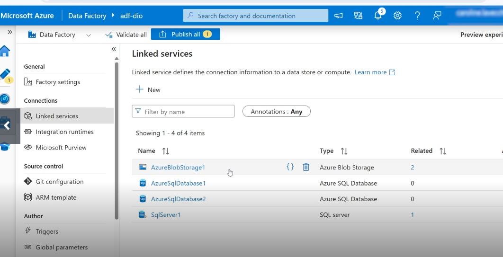
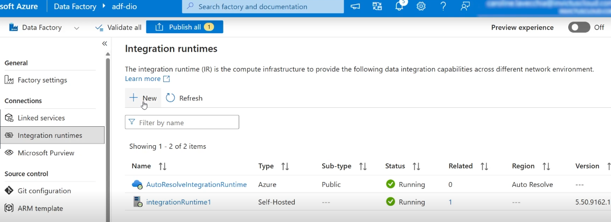
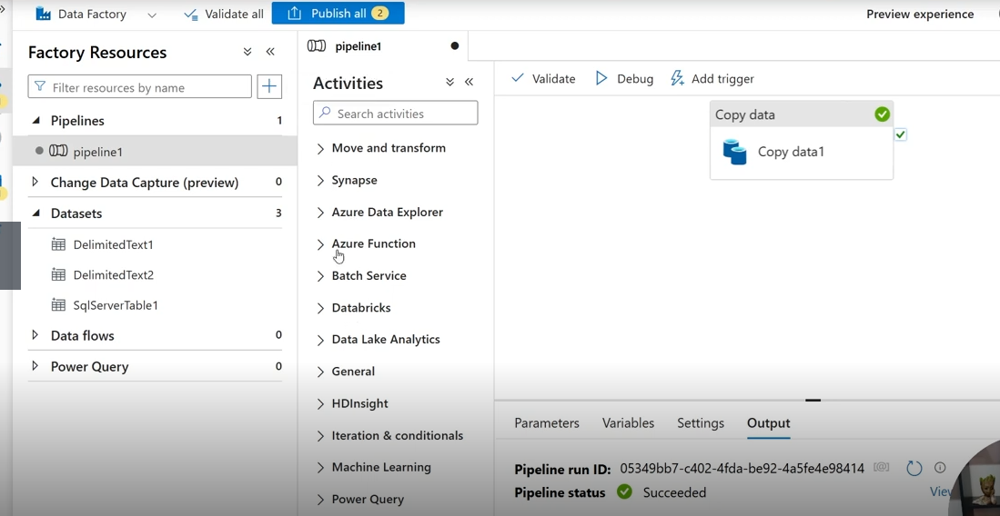

# Processo de Cópia de Dados para o Data Lake com Azure Data Factory

Este repositório documenta o processo de cópia de informações de um ambiente de origem para um **Data Lake** utilizando o **Azure Data Factory (ADF)**. Abaixo estão capturas de tela das etapas principais, com uma breve explicação sobre o que cada tela representa dentro da estrutura do ADF.

---

## 1. Linked Services

**Descrição:**  
A tela de **Linked Services** mostra as conexões configuradas entre o Azure Data Factory e as fontes ou destinos de dados (por exemplo: bancos de dados SQL, armazenamento Blob, Data Lake, etc). Cada Linked Service funciona como um “conector” que permite ao ADF se comunicar com esses serviços externos de forma segura e autenticada.

---

## 2. Integration Runtimes

**Descrição:**  
A tela de **Integration Runtimes** exibe os ambientes de execução utilizados para mover e transformar dados. No Azure, você pode utilizar um runtime integrado (Azure), auto-hospedado (para ambientes on-premises) ou de terceiros. É nessa etapa que se define onde e como as atividades do pipeline serão executadas.

---

## 3. Factory Resources - Pipelines / Activities

**Descrição:**  
Esta tela apresenta os **Pipelines**, que são fluxos de trabalho compostos por uma sequência de **Activities** (atividades), como cópias de dados, transformações e execuções de scripts. Aqui é onde o processo de cópia dos dados para o Data Lake é orquestrado, definindo as fontes, destinos, e lógica de transformação ou movimentação.

---

